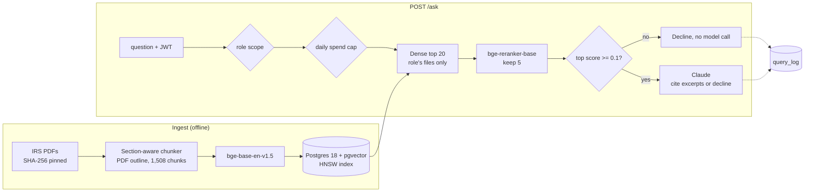

# pub17

[](https://github.com/Mundzuk-Uldin/IRS-Pub17/actions/workflows/retrieval-eval.yml)

Retrieval-augmented question answering over 333 pages (338,000 words) of IRS tax year 2025
publications, built to measure what each retrieval technique is actually worth
rather than to assemble a stack.

**Status:** Weekend 1 and the evaluation set are done. All four Weekend 2
changes are measured. Section-aware chunking and cross-encoder reranking were
adopted; Postgres full-text hybrid search and contextual enrichment were
rejected. Retrieval and generation run end to end against pgvector in Docker,
and answer accuracy is measured. The HTTP service is built, with JWT roles, a
spend cap, a refusal threshold, and a log of every request.

## Results

| Configuration | recall@1 | recall@3 | recall@5 | MRR@5 | loose recall@5 | answer acc. |
|---|---|---|---|---|---|---|
| Naive 350-word windows, dense only (baseline) | 51.7% | 78.3% | 83.3% | 0.642 | 86.7% | 86.7% |
| Section-aware chunking | 63.3% | 86.7% | 91.7% | 0.753 | 95.0% | — |
| **+ cross-encoder reranking**, 20 → 5 | **90.0%** | **98.3%** | **98.3%** | **0.939** | 98.3% | **98.3%** |
| *rejected:* + heading path in the embedded text | 55.0% | 85.0% | 93.3% | 0.696 | 96.7% | — |
| *rejected:* + fold sections under 40 words | 61.7% | 83.3% | 90.0% | 0.734 | 93.3% | — |
| *ablation:* naive chunks + reranking | 90.0% | 93.3% | 96.7% | 0.924 | 98.3% | — |
| *rejected:* section + hybrid full-text (RRF), no rerank | 46.7% | 73.3% | 81.7% | 0.605 | 90.0% | — |
| *rejected:* section + hybrid full-text (RRF) + rerank | 90.0% | 98.3% | 98.3% | 0.939 | 98.3% | — |
| *rejected:* section + generated section context, no rerank | 60.0% | 90.0% | 95.0% | 0.745 | 96.7% | — |
| *rejected:* section + generated section context + rerank | 90.0% | 95.0% | 95.0% | 0.922 | 96.7% | — |

n=60 questions, `bge-base-en-v1.5` retrieval, `bge-reranker-base` reranking,
top-k=5, 350-word chunk ceiling. Measured
by `eval/baseline_numpy.py` (exhaustive search, no services) and confirmed
through pgvector by `eval/run_eval.py`; every run is appended to
`results/runs.csv`.

**One question is 1.7 points.** With n=60, only naive → section clears that
margin comfortably: +11.6 points at recall@1 and +8.4 at recall@5, seven and
five questions. The two rejected variants sit within a question or two of the
row above them, so they are recorded as measured, not as findings.

Section chunking fixed 8 of the baseline's 10 misses (the married-filing-
separately `$5` threshold, both premium tax credit examples, the 401(k) and
adoption limits, the overtime cap, the car-loan income limit, the MFS capital
loss limit)
and introduced 3 new ones (q012, q024, q029).

Putting the heading path into the embedded text bought one question at
recall@5 and cost five at recall@1. It was not adopted.

**Reranking did most of the work.** Over-fetching 20 dense candidates and
rescoring them with a cross-encoder took recall@1 from 63.3% to 90.0% and
recall@5 from 91.7% to 98.3%. That is the ceiling: dense recall@20 is also
98.3%, so the reranker ordered the pool as well as the pool allowed. The
ablation matters more than the headline, though. Naive chunks with reranking
reach 90.0% at recall@1 and 96.7% at recall@5, so once the reranker is in
place, section chunking is worth one question at recall@5, which is within
noise. Most of what section chunking gained on its own, the reranker recovers
anyway. Section chunking stays because it costs nothing at query time and
never measured worse, but the claim it supports is small.

**The one remaining miss is out of reach, not misranked.** q028 asks how much
of the child tax credit is claimable as the additional child tax credit. Its
answer chunk sits at dense rank 49, outside the 20-candidate pool, because it
says "ACTC" where the question spells the name out. Widening the pool to 50
would fix it, and it wasn't done: that would be tuning the pipeline to one
question it is scored on. Lexical hybrid search is the change that should be
tested against it.

**Through pgvector the numbers hold.** Section chunks score identically
through the HNSW index and through exhaustive search, both dense-only and
reranked, and so do naive chunks dense-only. The one difference was naive
chunks with reranking: 88.3% at recall@1 in one run against 90.0% exhaustive.
That was q013, where that run's 20-candidate pool from the index differed from
the exhaustive one. pgvector builds its HNSW graph randomly at each ingest, and
the next build matched exhaustive search exactly, at both `ef_search` 40 and
200. So an approximate index can move a question when you over-fetch 20
candidates, and it is a one-question effect here.

**Hybrid full-text search was rejected.** Dense results were fused with
Postgres `tsvector` results by Reciprocal Rank Fusion (k=60, 50 results from
each side). Postgres's default query parser ANDs every word, and it matched 0
chunks for a full-sentence question, so the terms are OR-ed and `ts_rank_cd`
ranks the matches. Without the reranker, hybrid made retrieval worse (63.3% →
46.7% at recall@1). Tax prose repeats "credit" and "tax" on nearly every page,
so OR-ed term frequency pulls noise into the top five. With the reranker it
changed nothing: the fused 20-candidate pool held exactly the answers the
dense pool did, and recall@20 was 98.3% for both. It didn't reach q028 either,
whose answer chunk isn't in the lexical top 50. It cost 15 ms more at p50 and
51 ms more at p95, so it is off by default (`PUB17_HYBRID=1`). The fusion depth
was fixed at 50 and not swept.

**Contextual enrichment was rejected.** Claude wrote a short
retrieval context for each of the 675 sections (median 49 words), naming the
publication, the section, and the rule it covers. Each chunk's embedding and
rerank input got its section's context in front of the text. Strict hits are
still judged on the chunk's own text, so a context that happens to mention an
answer figure can't score as retrieving it. Without the reranker, enrichment
gained two questions at recall@5 (91.7% → 95.0%) and lost two at recall@1
(63.3% → 60.0%). With the reranker it lost two at recall@5 (98.3% → 95.0%)
and gained nothing. pgvector matched exhaustive search exactly on both. It
didn't reach q028. Every difference is two questions, within noise, and
nothing improved on the adopted pipeline, so it's off by default. The 675
contexts are committed in `data/section_summaries.jsonl`, so
`PUB17_CHUNKER=section-context` reproduces the rows with no API spend. They
cost $2.44, against a $1.66 estimate that assumed 1.35 tokens per word. Tax
text runs at about 2.1, and the estimator now uses the measured rate. One
variant is untested: embedding with the context but reranking on the bare text.

**Answer accuracy follows retrieval.** Generation was measured once on the
baseline and once on the adopted pipeline, with Claude on all 60
questions: 86.7% → 98.3%, with a 100% citation rate in both runs. Every wrong
answer but one was a retrieval miss where the model said the excerpts didn't
contain the answer rather than guess. The exception is q043 in the baseline,
covered under the corpus issue below.

Both figures were rescored from saved answers with no new model calls, after
fixing one grading key. q053 is a yes/no question whose evidence is an AGI
figure, and a correct "Yes, you can claim the child" was failing for not
repeating "$12,000". Questions can now carry `grade_keys` that override the
evidence keys for grading only (`eval/rescore.py`). `results/runs.csv` keeps
the numbers as recorded, 85.0% and 96.7%.

A full generation run over the 60 questions costs about $0.41. A later run
was recorded at 96.7% and rescored to 98.3% after a second paraphrase false
negative: q050's correct "can't be your qualifying child" didn't match the key
"isn't your qualifying child". A grading key can now list equivalent
phrasings.

**Latency** through Postgres, per query on the development GPU: dense
retrieval 9 ms p50 / 10 ms p95, dense plus reranking 166 ms / 174 ms. The
reranker runs in unoptimized fp32 and is almost all of it.

## Architecture



Every request is logged, answered or not. Hybrid full-text search and
contextual enrichment are built but off by default, because neither beat the
path above.

## Why the numbers are trustworthy

The evaluation set is the point of this project, so it is built to be
falsifiable rather than plausible.

**Gold is anchored on pages and verbatim spans, not chunk ids.** Chunk ids do
not survive a re-chunk. Anchoring gold to them would mean Weekend 2's new
chunker silently invalidates the baseline it is supposed to be measured
against — the one comparison the project exists to make.

**A hit means the chunk contains the answer.** A retrieved chunk counts only if
it holds the verbatim gold span, or sits on a gold page and contains every
answer key. The first version of the harness accepted page overlap alone, and
that overstated every configuration, the baseline included (86.7% loose against
83.3% strict). Section chunking makes the gap matter: the 1040 instructions
bookmark every form line, so a pure split-on-outline yields hundreds of
heading-sized fragments like `Line 1a` that sit on the right page and hold
nothing. The loose number is still reported, and the Weekend 1 rows under the
old rule are kept in `results/runs_v1_loose.csv`.

**Every question is checked against the PDFs.** `eval/verify_questions.py`
confirms that each gold page exists, that the answer-bearing span appears
verbatim on it, and — the strict check — that *every* gold page independently
contains the answer. It exits nonzero on any failure, so CI can gate on it.

**Gold lists every page that genuinely answers.** The IRS corpus duplicates
heavily: Pub 17 chapter 10 restates Pub 501's standard deduction charts, and
the 1040 instructions restate both. The first draft of the eval listed one
source page per question and scored 75.0% recall@5. Scanning the whole corpus
for answer-bearing pages and reading each candidate raised the gold set from 85
pages to 188 and the measured baseline to 86.7% — the retrieval had not
changed, the ruler had. Coincidental number matches were reviewed and rejected
(EIC lookup tables, the $10,000 SALT floor against the $10,000 car-loan cap,
student-loan MAGI limits that share the car-loan thresholds).

**Answers are graded on exact keys, not by a model.** These questions have
dollar amounts, rates, and yes/no answers. An LLM judge would be more forgiving
of paraphrase and would also make the metric depend on a second model's mood.

**The corpus postdates model training.** Tax year 2025 includes the Schedule
1-A deductions, a $2,200 child tax credit, and a $40,000 SALT cap. A model
answering from memory gets these confidently wrong, so the eval measures
retrieval rather than recall of pretraining.

## The eval set

60 questions across 15 topics — 30 direct lookups, 17 rule questions, and 13
worked examples taken from the publications' own examples with their stated
answers.

```
standard_deduction 9   new_deductions_2025 11   medical 8   filing_requirement 6
dependents 5   mileage 4   adoption 3   child_tax_credit 3   retirement 3
salt 2   filing_status 2   capital_gains 1   deadlines 1   digital_assets 1
itemized 1
```

## Corpus

Pub 17, Pub 501, Pub 502, the Form 1040 instructions, and Schedules 1, 1-A, 2,
and 3 — 338,000 words, 1,130 chunks at the baseline chunk size.

## The service

`pub17/api.py` wraps the pipeline in FastAPI. `POST /ask` takes a question and
returns a cited answer. Each request passes three gates, and every outcome,
answered, refused, or failed, is written to `query_log` with the caller, role,
tokens, cost, per-stage latency, and retrieved chunk ids.

- **JWT roles scope the corpus.** `viewer` sees Pubs 17, 501, and 502;
  `preparer` also sees the 1040 instructions and schedules; `admin` sees
  everything plus `/admin/logs` and `/admin/spend`. Retrieval is filtered to
  the role's files in SQL, so a scoped user can't get a chunk from outside the
  scope, even as a citation. Tokens are HS256, the secret must be at least 32
  bytes, and the service won't start without it.
- **A daily spend cap** (`PUB17_DAILY_SPEND_CAP_USD`, default $1) is checked
  against logged spend before any model call. Past it, requests get a 429.
- **A refusal threshold** on the reranker's best score declines without
  calling the model. `eval/calibrate_refusal.py` chose 0.1 using the 60
  answerable questions and 14 verified unanswerable ones. It's the highest cut
  that refuses no answerable question (the lowest scores 0.137), and it
  catches only 3 of the 14 unanswerable ones, the clearly off-topic ones.
  Near-topic questions the corpus can't answer score as high as real ones: the
  German VAT rate scored 0.9999. For those, the model's own "the excerpts don't
  say" is the safeguard, and this gate only saves paying for obvious misses.
  That safeguard holds. `eval/refusal_check.py` sent all 14 through the /ask
  path: the gate stopped 3, and the model declined each of the other 11,
  saying the excerpts don't contain the answer. That includes the Medicare
  Part B premium, whose topic Pub 502 covers without giving the figure. None
  got an invented answer. The check cost $0.10.
- **Upstream failures are logged.** If the model API fails, the request is
  logged as `upstream_error` and the caller gets a 502. This was found live:
  the account ran out of credit during testing, and the first version returned
  a bare 500 and logged nothing.

The first real request through the running container, "How much of my 2025
tips can I deduct?" as a `preparer`, returned the correct answer (up to
$25,000, limited above $150,000 MAGI or $300,000 married filing jointly),
citing Pub 17 and the Schedule 1-A instructions. It cost $0.0079
(3,127 tokens in, 162 out), took 210 ms to retrieve, 3,017 ms to rerank, and
2,158 ms to generate, and was logged with all three timings and its five
chunk ids.

In the container the models run on CPU. Reranking 20 candidates takes about
3 s there against 170 ms on the development GPU, and the image is 5 GB with
both models built in. `tests/test_api.py` covers auth, role scoping, both
refusal gates, the upstream-error path, and the log. It runs against the real
database and models with generation faked, so it costs nothing.

**CI** (`.github/workflows/retrieval-eval.yml`) runs on demand and on pull
requests that touch the pipeline, the eval, or the service, never on every
push, and needs no API key and spends nothing. Both of its jobs first check
the downloaded corpus against `data/raw/SHA256SUMS`: the IRS republishes PDFs
under the same URLs, and every page number in the eval refers to these exact
files.

- `retrieval` verifies the eval set against the corpus, then runs the
  retrieval-only eval and fails if strict recall@5 drops below 96.7%, one
  question under the adopted 98.3%.
- `tests` starts a pgvector service container, ingests the section chunks,
  and runs the service tests with generation faked.

On its first run on GitHub's CPU runners, `retrieval` reproduced the GPU
numbers exactly: 90.0% at recall@1, 98.3% at recall@5, MRR 0.939, the same
single miss (q028). `tests` passed 10 of 10. The jobs took 24 and 13 minutes,
mostly embedding the corpus on CPU.

**CD** (`.github/workflows/release-image.yml`) builds the API image and
publishes it to GitHub Container Registry on a `v*` tag or by hand, tagged
with the version, the short commit sha, and `latest`. The first run took three
minutes, and the image is public:

```bash
docker pull ghcr.io/mundzuk-uldin/irs-pub17:latest
```

## Setup

These steps were tested on a fresh clone from GitHub: the corpus download and
checksum check, `docker compose up`, ingest, and a `viewer` token's `curl`
that returned the correct head-of-household deduction citing only the
publications that role can see.

```bash
pip install -r requirements.txt
./scripts/download_corpus.sh
```

Retrieval scoring needs nothing else:

```bash
python3 eval/verify_questions.py      # gate: is the eval set still grounded?
python3 eval/baseline_numpy.py --csv  # score the default pipeline, no services required
PUB17_CHUNKER=naive PUB17_RERANK=0 python3 eval/baseline_numpy.py   # the Weekend 1 baseline
```

For the full pipeline (pgvector storage, generation, latency and cost metrics):

```bash
docker compose up -d --wait db  # Postgres 18 + pgvector on localhost:5434
python3 scripts/ingest.py
export ANTHROPIC_API_KEY=sk-ant-...
python3 scripts/ask.py "what is the standard deduction for a single filer?"
python3 eval/run_eval.py --retrieval-only        # free
python3 eval/run_eval.py                         # full run, about $0.40
python3 eval/rescore.py results/<run>.jsonl      # re-grade saved answers, free
```

To use a native Postgres instead, install pgvector, run
`./scripts/setup_db.sh`, and set `PUB17_DSN`.

The service:

```bash
python3 -c "import secrets; print('PUB17_JWT_SECRET=' + secrets.token_urlsafe(48))" > .env  # once; git-ignored
docker compose up -d --wait        # Postgres + the API on localhost:8000
set -a; . ./.env; set +a
TOKEN=$(python3 scripts/mint_token.py --role preparer --sub you)
curl -s -X POST localhost:8000/ask -H "Authorization: Bearer $TOKEN" \
     -H 'Content-Type: application/json' -d '{"question": "How much of my 2025 tips can I deduct?"}'
python3 -m pytest                  # service tests; generation is faked, so they're free
```

## Layout

```
docker-compose.yml         Postgres 18 + pgvector on localhost:5434
pub17/config.py            settings, all env-overridable
pub17/chunking.py          naive and section-aware chunkers (PUB17_CHUNKER)
pub17/rerank.py            cross-encoder reranking (PUB17_RERANK)
pub17/api.py               FastAPI service: /ask, /admin/logs, /admin/spend
pub17/auth.py              JWT roles and the collections each may query
pub17/store.py             pgvector schema; retrieve() = dense (or hybrid) + rerank
pub17/generate.py          cited answer generation
scripts/ingest.py          parse -> chunk -> embed -> idempotent upsert
scripts/ask.py             ask a question, get a cited answer
scripts/mint_token.py      issue a JWT for a role
scripts/summarize_sections.py  one generated context per section, cached
data/section_summaries.jsonl   the 675 contexts, so enrichment reruns for free
eval/questions.jsonl       60 verified questions
eval/verify_questions.py   grounding check, exits nonzero on failure
eval/run_eval.py           scores the pgvector pipeline, appends to runs.csv
eval/rescore.py            re-grades saved answers after a grader change, free
eval/calibrate_refusal.py  picks the refusal threshold; negatives in unanswerable.jsonl
eval/refusal_check.py      sends the negatives through /ask's path; makes model calls
tests/test_api.py          service tests, generation faked
Dockerfile                 the API image, CPU inference, models built in
.github/workflows/         CI (retrieval eval + service tests), CD (image to ghcr.io)
data/raw/SHA256SUMS        the exact PDFs the eval was built on
eval/baseline_numpy.py     scores retrieval with no services
results/runs.csv           every configuration measured under the strict hit rule
results/runs_v1_loose.csv  Weekend 1 rows under the retired page-overlap rule
```

## What the baseline gets wrong

Eight of sixty questions miss at k=5, and the failures are consistent rather
than random:

- **Tables shredded mid-row.** Fixed 350-word windows cut the standard deduction
  and filing threshold charts apart, so the row and its header land in different
  chunks. This is what breaks the married-filing-separately `$5` threshold.
- **Context stripped from worked examples.** The Pub 502 premium tax credit
  examples retrieve their neighbours instead of themselves, because the chunk
  holding the arithmetic never says which deduction it belongs to.
- **"What's New" summaries lose their subject.** The 401(k) limits and the
  additional child tax credit amount sit in dense bulleted summaries whose
  topic is stated only in a heading the chunker discarded.

Each maps onto a planned Weekend 2 change — section-aware chunking that keeps
tables whole, and contextual enrichment that prepends the parent section — which
is the point of measuring before changing anything.

## What I'd do next

- **Query expansion for abbreviations.** q028's answer says "ACTC" and the
  question spells the name out. It is the one retrieval miss, and dense,
  full-text, and context-enriched retrieval all failed to reach it.
- **A bigger eval with a held-out split.** At n=60 one question is 1.7
  points, so only the chunking and reranking gains clear noise, and every
  setting was chosen on the questions it is scored on.
- **A judged answer check next to the exact keys,** calibrated against hand
  grades. Exact keys have produced two false negatives on paraphrase so far.
- **A faster reranker.** It is about 3 s of a 5 s request on CPU; ONNX export
  or a smaller cross-encoder is the obvious first try.
- **A second vector backend** (Qdrant) behind the same `retrieve()`
  interface, for comparison.

## Known weak

- One embedding model and one chunk size; neither has been swept.
- Refusal is measured on only 14 unanswerable questions. All 14 were
  refused, but that is a small, hand-picked set.
- CI takes about 24 minutes on GitHub's CPU runners, most of it embedding the
  corpus, once in each job. Only the models are cached between runs.
- n=60, and every configuration is chosen on the same 60 questions it is scored
  on. There is no held-out split, so small wins are indistinguishable from
  fitting the eval.
- An abbreviation mismatch like "ACTC" against "additional child tax credit"
  (q028) is out of reach of dense, full-text, and context-enriched retrieval
  alike. Query expansion is the idea left to test against it.
- The HNSW graph is rebuilt randomly on every ingest, so with a 20-candidate
  pool a rebuild can move a question (q013 once). Runs aren't pinned to one
  index build.
- Each answer-accuracy figure is a single run, and generation isn't
  deterministic.
- The corpus contradicts itself on q043. Pub 17 gives the age 60–63 401(k)
  limit as $37,750 (pp. 3 and 49), but its own $11,250 catch-up implies
  $23,500 + $11,250 = $34,750. The eval grades faithfulness to the corpus, so
  the question expects $37,750. The baseline's answer of $34,750 was consistent
  with the excerpts it retrieved.
- Exact-key grading cannot tell a correct answer from one that states the right
  number for the wrong reason.
- `page_start`/`page_end` come from the words in a chunk, so a chunk spanning a
  page boundary is credited with both pages.
